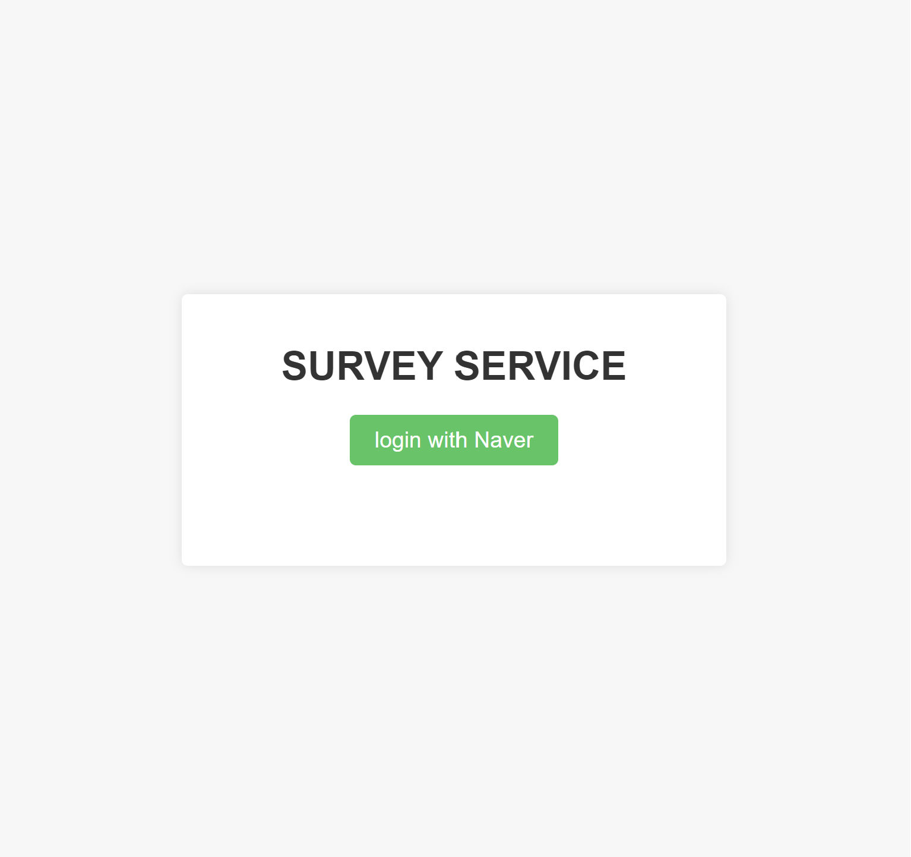
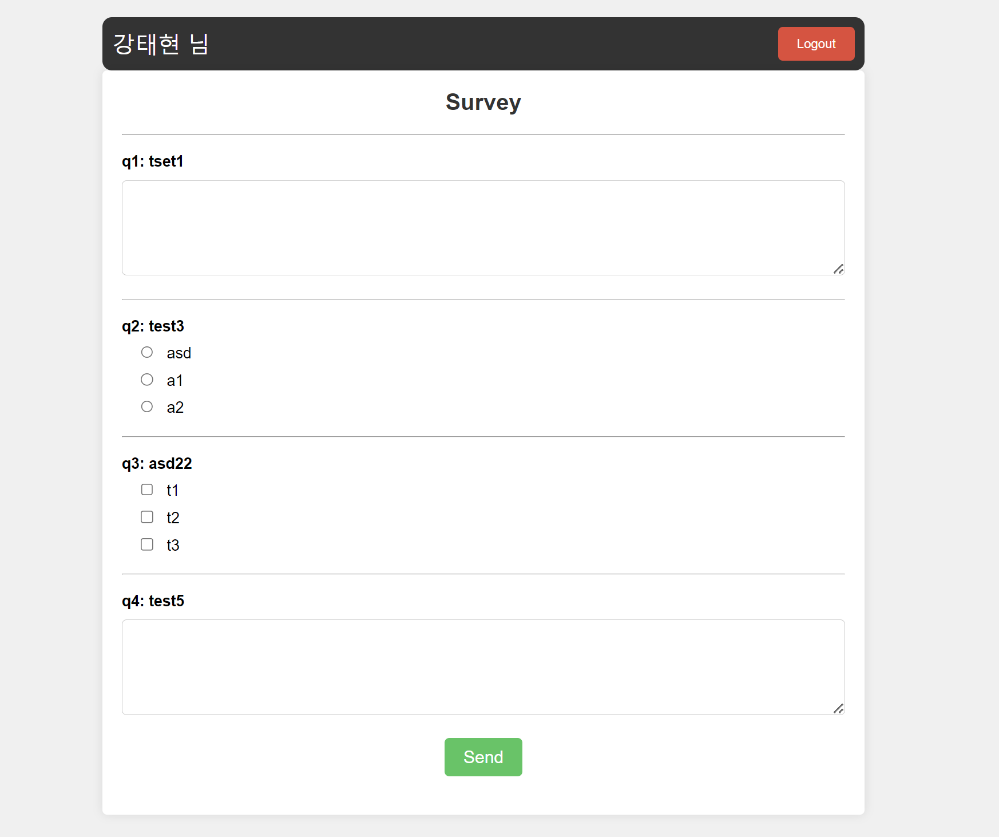
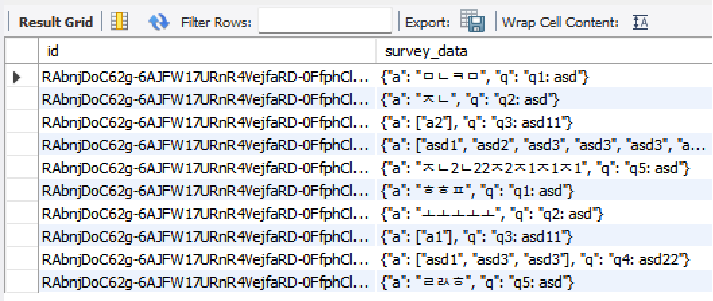

# survey-service

- using stack

  - **express**
  - **passport**
  - **ejs**
  - **mysql**

#

## WEB SERVICE 구성 정보

- naver login을 위해서 .env에 clientid와 clientsecretid 발급정보 입력

- 환경설정하기 [[./config/survey.yml 보기](./config/survey.yml)]

  ```
  question:
  q1:
      type: "content"
      question: "질문1"
  q2:
      type: "option"
      question: "질문2"
      o1: "선택1"
      o2: "선택2"
  q3:
      type: "selection" //중복 가능
      question: "질문3"
      s1: "선택1"
      s2: "선택2"
  ```

  위의 형태를 지키면 자유롭게 게시판의 형태를 만들어준다.

- DB 구성

  - user DB와, survey DB가 존재한다.
  - user DB에는 naver_login을 통해서 받은 정보로 구성된다.
  - survey DB에서 id와 survey_data가 json 형태로 파싱되어 저장되어 있다.

- 페이지 구성

  - login page

      

  - survey page
    

* db 저장 형태
  
